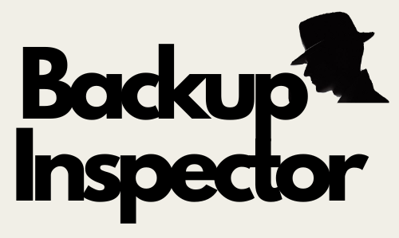

# BackupInspector
### Author: Adill Al-Ashgar
#### Verify Data Backups by Comparing Directory Contents

 

    - Verify data backup integrity
    - Quickly find all missing files
    - One button tool to rescue all missing files

## Introduction
BackupInspector is a simple windows program that allows you to verify that your backup has completed and copied all files. BackupInspector checks the reference and target directories, identifying file matches, and presenting a comprehensive report, providing a handy one button to rescue all the uncopied files. This tool was born out of the frustration I experienced with various backup software applications failing to preserve all my files accurately. 

## Table of Contents
- [Installation](#installation)
- [Usage](#usage)
- [License](#license)
- [Contributions](#contributions)
- [Contact](#contact)

## Installation
BackupInspector is primarily developed for Windows users, and we provide a pre-packaged executable for easy installation on Windows. However, it can also be run on other operating systems by executing the Python code directly.

### Windows
To install BackupInspector on Windows, follow these steps:

1. Download the latest release of BackupInspector.exe from this repo using the following link: [BackupInspector Download](https://github.com/Adillwma/BackupInspector/raw/main/BackupDetective.exe)

2. Run the downloaded BackupInspector.exe file.

### Other Operating Systems
For users on operating systems other than Windows, you can run BackupInspector by following these steps:

1. Ensure that you have Python installed on your system. You can download Python from the official website: [Python Downloads](https://www.python.org/downloads/).

2. Open a terminal or command prompt.

## Usage

1. Open BackupInspector by double-clicking the executable file.

2. Add the reference folder(s) and target folder(s) by clicking the corresponding "Add Folder" button. Refrence folders are the folders that contain the original files, and target folders are the folders that contain the copied files. The backup opperation should be completed before running BackupInspector for it to be able to check the backup.

3. Click the "Run BackupInspector" button to start the process. The comparison may take a few minutes depending on the number of files and folders. On completion a .txt file will be genrated and oppened that contains the report of how many files are missing from the traget folders and a list of the filenames. The .txt file is stored in your temp files directory, if you wish to retain a copy of the report please 'save as' the notepad file while it is open.

4. Missing files can be copied manually or all at once by pressing the "Copy All Missing Files" button. This will copy all the missing files from the reference folders to the target folders in thier correct locations. It is recomended to re-run BackupInspector after copying the missing files to ensure that all files have been copied correctly.

 

*The current BackupInspector user interface, v2.0.0.*

# License
This project is not currently licensed. Please contact for more information.

# Contributions
Contributions to this codebase are welcome! If you encounter any issues, bugs or have suggestions for improvements please open an issue or a pull request on the [GitHub repository](https://github.com/Adillwma/BackupInspector).

# Contact
For any further inquiries or for assistance in running the simulation, please feel free to reach out to me at adill@neuralworkx.com.

