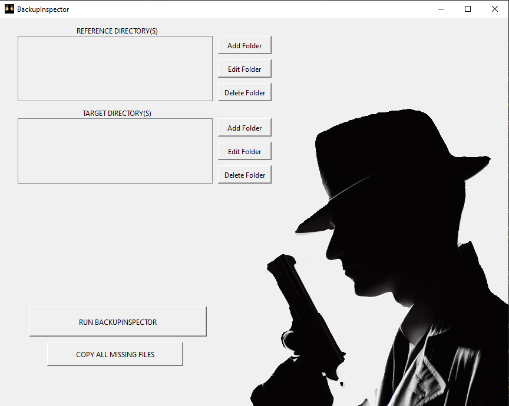

# BackupInspector
### Author: Adill Al-Ashgar
#### Verify Data Backups by Comparing Directory Contents

 

    - Laboratory quick data analysis
    - Verifying data whilst setting up experiments
    - Quickly creating publication ready plots

## Introduction
BackupInspector is a simple python script that allows you to compare the contents of two sets of directories. It identifies file matches and reports the number of unmatched files and their filenames. 

## Table of Contents
- [Installation](#installation)
- [Usage](#usage)
- [License](#license)
- [Contributions](#contributions)
- [Contact](#contact)

## Installation
BackupInspector is primarily developed for Windows users, and we provide a pre-packaged executable for easy installation on Windows. However, it can also be run on other operating systems by executing the Python code directly.

### Windows
To install BackupInspector on Windows, follow these steps:

1. Download the latest release of BackupInspector here: [BackupInspector Download](https://drive.google.com/file/d/1uTolk4qEOtARLhcJpGRvSeB6ji6Jhip3/view?usp=sharing)

2. Run the downloaded BackupInspector_v1.exe file.

### Other Operating Systems
For users on operating systems other than Windows, you can run BackupInspector by following these steps:

1. Ensure that you have Python installed on your system. You can download Python from the official website: [Python Downloads](https://www.python.org/downloads/).

2. Open a terminal or command prompt.

## Usage

 

# License
This project is not currently licensed. Please contact for more information.

# Contributions
Contributions to this codebase are welcome! If you encounter any issues, bugs or have suggestions for improvements please open an issue or a pull request on the [GitHub repository](https://github.com/Adillwma/BackupInspector).

# Contact
For any further inquiries or for assistance in running the simulation, please feel free to reach out to me at adill@neuralworkx.com.
